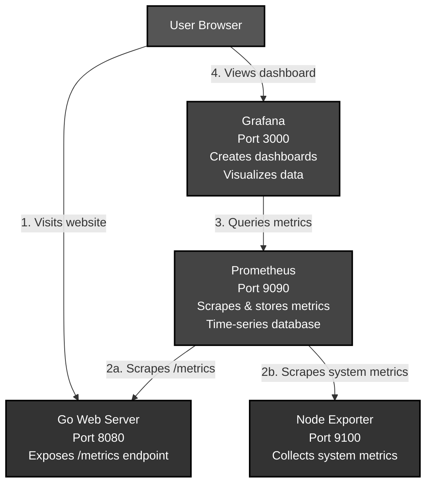
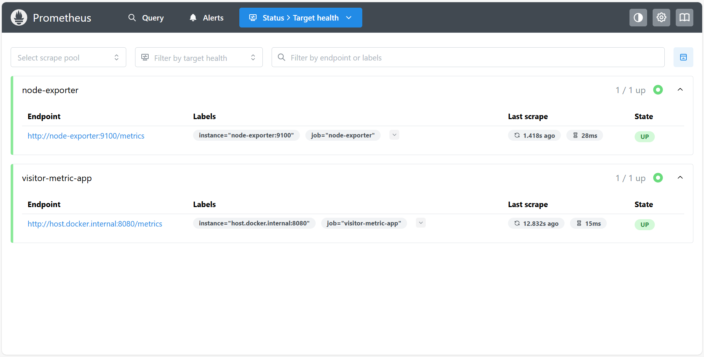
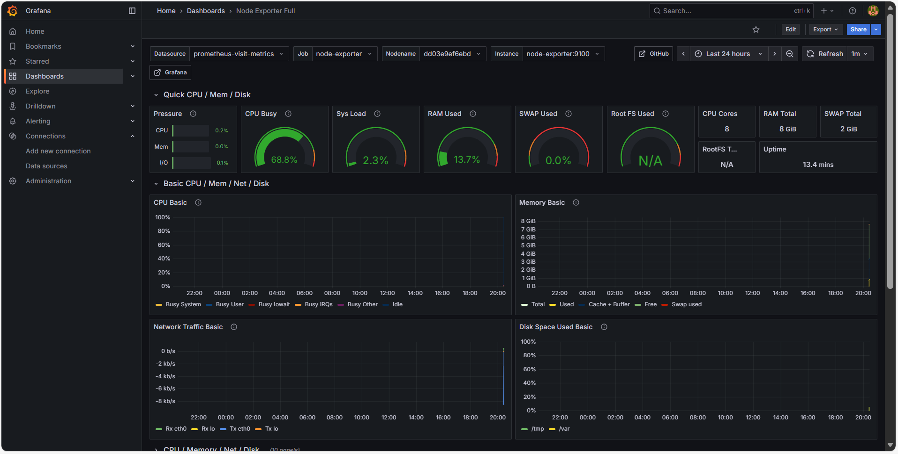

# Application & System Monitoring Stack

A hands-on tutorial for monitoring applications with Prometheus and Grafana. This project demonstrates both application-level metrics (HTTP requests from a Go web server) and system-level metrics (CPU, memory, disk) using Node Exporter.

---

## Table of Contents

- [Architecture](#architecture)
- [Dashboard Preview](#dashboard-preview)
- [Dashboard Configuration](#dashboard-configuration)
- [Built With](#built-with)
- [Getting Started](#getting-started)
  - [Prerequisites](#prerequisites)
  - [Installation & Running](#installation--running)
- [Setup](#setup)
  - [Setting Up Prometheus](#setting-up-prometheus)
  - [Setting Up Your Grafana Dashboard](#setting-up-your-grafana-dashboard)
- [Usage](#usage)
- [Troubleshooting](#troubleshooting)
- [Project File Structure](#project-file-structure)

---

## Architecture

This diagram shows the complete monitoring flow from user interaction to real-time visualization. Each component serves a specific role in collecting, storing, and displaying metrics from the Go web application and system resources.



### How It Works

1. **User Traffic Generation**: Users visit the Go web server, generating HTTP requests that create application metrics
2. **Metrics Collection**: 
   - Prometheus scrapes application metrics from the Go app's `/metrics` endpoint every 15 seconds
   - Prometheus scrapes system metrics (CPU, memory, disk, network) from Node Exporter every 15 seconds
3. **Data Querying**: Grafana uses PromQL queries to fetch metrics from the Prometheus database
4. **Real-time Visualization**: Users view live application and system metrics in Grafana dashboards

---

## Dashboard Preview

**Prometheus Targets Page:**
*This picture confirms that Prometheus is successfully connected to and scraping both the Go application and Node Exporter.*



**Application Metrics Dashboard:**
*This picture shows the application dashboard visualizing the rate of HTTP requests per second.*


**System Metrics Dashboard:**
*This picture shows the Node Exporter dashboard with system-level metrics including CPU, memory, disk, and network usage.*



---

## Dashboard Configuration

**Setting up the Application Metrics Panel:**
*This picture shows the configuration for tracking request rates using the `rate(http_requests_total[5m])` query.*


The query uses:
- **Metric**: `http_requests_total`
- **Operation**: `Rate` over a 5-minute range
- **Visualization**: Time series chart

The Node Exporter dashboard (Dashboard ID: 1860) tracks:
- **CPU Metrics**: CPU usage percentage, system load
- **Memory Metrics**: RAM usage, swap usage
- **Disk Metrics**: Disk space usage, I/O operations
- **Network Metrics**: Network traffic (bytes sent/received)

---

## Built With

* Go - Backend web server and application logic
* Prometheus - Metrics collection and time-series database
* Grafana - Data visualization and dashboard creation
* Node Exporter - System and hardware metrics collector
* Docker & Docker Compose - Containerization and orchestration

---

## Getting Started

To get a local copy up and running, follow these steps.

### Prerequisites

You must have the following software installed:
* Go (version 1.25.1 or later)
* Docker and Docker Compose

### Installation & Running

1.  **Clone the repository:**
    ```bash
    git clone https://github.com/14yashh/prometheus-visit-metrics.git
    cd prometheus-visit-metrics
    ```

2.  **Start the Go Application:**
    Open a terminal, navigate into the web server's directory, and run the application.
    ```bash
    cd web-server
    go mod tidy  # Download dependencies if needed
    go run main.go
    ```
    The server should display: `Go server starting on port 8080...`

3.  **Start the Monitoring Stack:**
    Open a **second** terminal in the project's root directory and launch the Docker containers.
    ```bash
    docker-compose up
    ```

---

## Setup

### Setting Up Prometheus

Prometheus is configured via the `prometheus.yml` file in your project root. Here's what you need to know:

1. **Scrape Configuration:**
   - **Application Target**: `host.docker.internal:8080` (your Go web server)
   - **System Target**: `node-exporter:9100` (Node Exporter container)
   - **Scrape Interval**: 15 seconds (defined in global config)
   - **Metrics Paths**: `/metrics` for both targets

2. **Verify Prometheus is Scraping:**
   - Go to `http://localhost:9090/targets`
   - Check that both targets show as "UP":
     - `visitor-metric-app` (Go application)
     - `node-exporter` (system metrics)
   - If either is down, verify the respective service is running

3. **Query Metrics:**
   - Navigate to `http://localhost:9090/graph`
   - Try application queries: `http_requests_total` or `rate(http_requests_total[5m])`
   - Try system queries: `node_cpu_seconds_total` or `node_memory_MemAvailable_bytes`
   - Use the "Execute" button to see results

### Setting Up Your Grafana Dashboard

1. **Add Prometheus Data Source:**
   - Navigate to Configuration → Data Sources
   - Add Prometheus with URL: `http://prometheus:9090`
   - **Note:** Use `prometheus:9090` (not `localhost:9090`) because Grafana communicates with Prometheus inside Docker's network
   
2. **Create Application Metrics Dashboard:**
   - Click on "+" → Dashboard → Add new panel
   - Select `prometheus-visit-metrics` as the data source
   - **Configure the Query:**
     - **Metric**: Select `http_requests_total`
     - **Operation**: Choose `Rate` with a range of `5m`
     - This creates the query: `rate(http_requests_total[5m])`
   - **Customize the Panel:**
     - Set visualization type to "Time series"
     - Add a descriptive title like "HTTP Request Rate"
     - Save the dashboard

3. **Create System Metrics Dashboard (Node Exporter):**
   
   **Option A: Import Pre-built Dashboard (Recommended)**
   - Click on "+" → Import Dashboard
   - Enter Dashboard ID: **1860**
   - Select your Prometheus data source
   - Click "Import"
   - This dashboard includes comprehensive system metrics: CPU, memory, disk I/O, network traffic, filesystem usage, and system uptime
   
   **Option B: Create Custom Dashboard**
   - Create a new dashboard or add panels to the existing one
   - Add panels for system metrics:
     - **CPU Usage**: `100 - (avg by (instance) (rate(node_cpu_seconds_total{mode="idle"}[5m])) * 100)`
     - **Memory Usage**: `(1 - (node_memory_MemAvailable_bytes / node_memory_MemTotal_bytes)) * 100`
     - **Disk Usage**: `100 - ((node_filesystem_avail_bytes * 100) / node_filesystem_size_bytes)`
     - **Network Traffic**: `rate(node_network_receive_bytes_total[5m])` and `rate(node_network_transmit_bytes_total[5m])`
   - Customize visualization types (gauges, time series, stat panels)
   - Save the dashboard

---

## Usage

Once everything is set up, you can use the monitoring stack:

* **Go Web App:** Visit `http://localhost:8080` to generate traffic and create application metrics data.
* **App Metrics:** View the raw application metrics at `http://localhost:8080/metrics` to see Prometheus-format data.
* **Node Exporter Metrics:** View system metrics at `http://localhost:9100/metrics` to see hardware and OS metrics.
* **Prometheus UI:** Access Prometheus at `http://localhost:9090` to query and explore both application and system metrics.
* **Grafana Dashboard:** Access Grafana at `http://localhost:3000` to view your configured dashboards for application and system visualizations.

---

## Troubleshooting

**Common Issues:**
* **Port conflicts**: Ensure ports 3000, 8080, 9090, and 9100 are available
* **Docker issues**: Make sure Docker daemon is running  
* **Metrics not showing**: Wait 15-30 seconds for initial Prometheus scraping
* **Go module issues**: Run `go mod tidy` in the web-server directory
* **Node Exporter not showing data**: Verify the node-exporter container is running with `docker ps`
* **Targets down in Prometheus**: Check that all containers are running and networking is properly configured

---

## Project File Structure

The repository is organized as follows:

```
.
├── docker-compose.yml          # Orchestrates all containers (Prometheus, Grafana, Node Exporter)
├── prometheus.yml              # Prometheus scrape configuration for app and system metrics
├── README.md                   # Project documentation
├── images/                     # Screenshots and documentation assets
│   ├── grafana-dashboard.png   # Application metrics dashboard
│   ├── grafana-config.png      # Application dashboard configuration
│   ├── node-exporter-dashboard.png  # System metrics dashboard
│   ├── node-exporter-config.png     # System dashboard configuration
│   └── prometheus-targets.png  # Prometheus targets status
└── web-server/                 # Go application directory
    ├── go.mod                  # Go module dependencies
    ├── go.sum                  # Dependency checksums
    └── main.go                 # Main Go application with metrics
```